## User Guide

TDvis is an interactive visualization tool designed for Topdown mass spectrometry data, 
presented in a scroll-like interface that reveals multi-dimensional proteomic information.

**Core Value Propositions**:
- 🎨 Thermal Distribution Mapping: Visualize protein variants' chromatographic distribution
- 🔍 Intelligent Peak Recognition: Auto-calculate mass intervals for PTMs identification
- 🛠️ Customizable Analysis: Support user-defined modification types for targeted search
- 📊 Spectra Visualization & Comparison: 3D rendering and cross-sample spectral alignment

---

## Quick Start

### 1. Data Preparation
**Requirements**:
- Select raw result folder generated by Toppic
- Ensure containing `_html` subdirectory (web version supports direct selection)

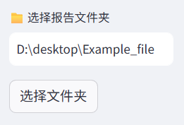

### 2. Report Dashboard
**Access**: First tab displays basic detection report  
**Key Metrics**:
- Total protein identification
- MS feature table presentation & download

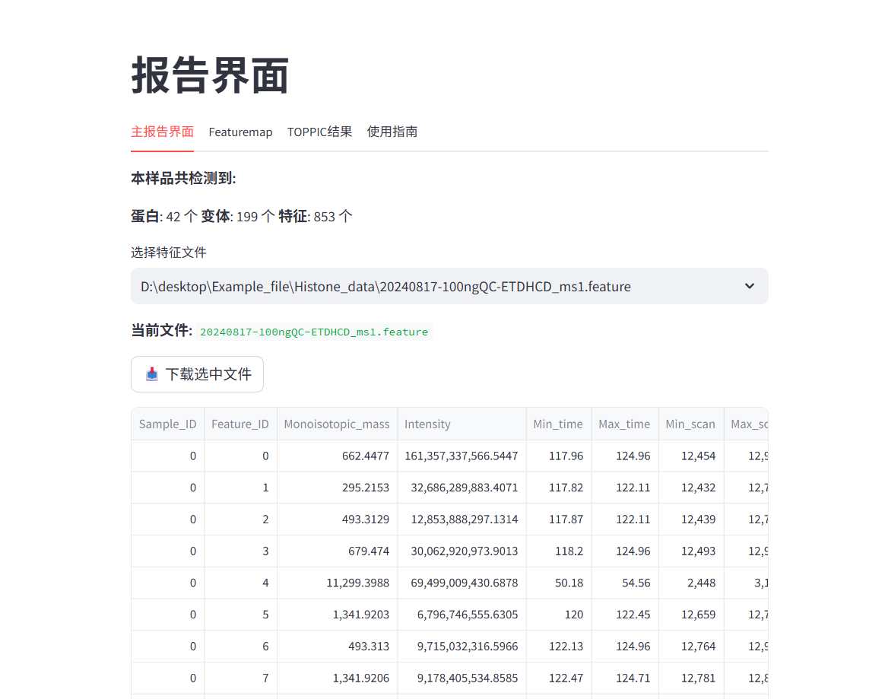

### 3. 3D Visual Analytics

#### 3.1 Feature Heatmap
**Coordinate System**:
- X-axis: Retention time (minutes)
- Y-axis: Fragment mass (Da)

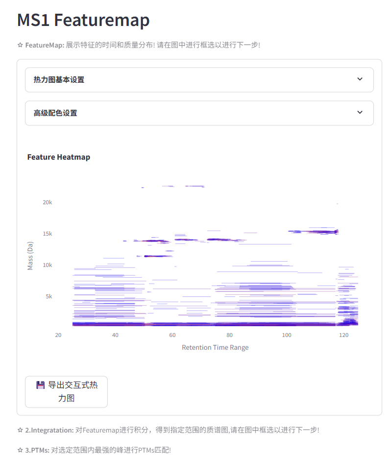

**Operation Guide**:
1. Use 4th toolbar item 「Range Selector」 to target area
   - *Double-click to reset selection state*
2. Auto-generate integrated spectrum for selected region
3. Case Study (Histone Analysis):
   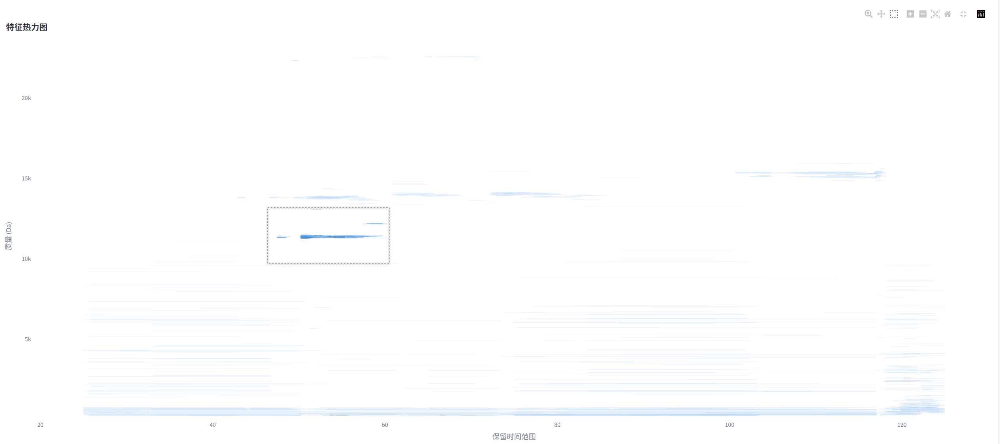
   Five clustered peak groups correspond to histone's primary proteoforms.

#### 3.2 Spectral Integration Analysis
**Coordinate System**:
- X-axis: Fragment mass (Da)
- Y-axis: Normalized Intensity (%)

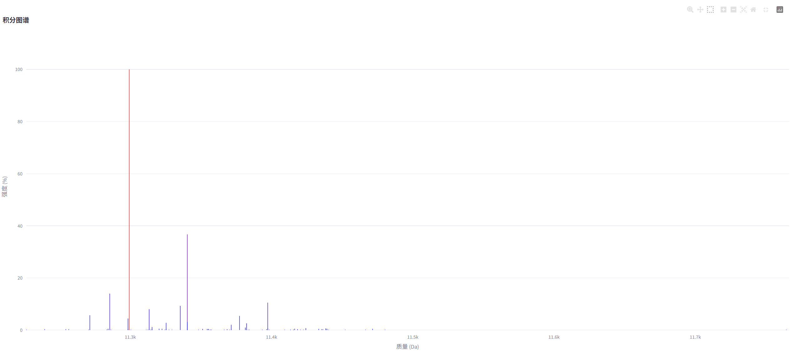

**Analytical Techniques**:
- Identify base peak with maximum intensity
- Peak interval: *Set mass difference threshold between adjacent peaks*

#### 3.3 PTMs Identification
**Filter Parameters**:

- Target Mass: Defaults to highest intensity peak, supports *manual hypothesis input*
- Mass Range: *Neighbor search radius (±Da) for peak matching*
- Intensity Threshold: *Signal noise filtration (> set value%)*. Absence of target peaks may indicate sub-threshold signals.

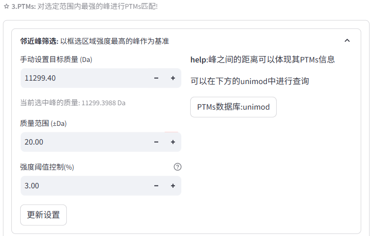

**Advanced Features**:
1. **Custom Modifications**: Add user-defined PTMs  
   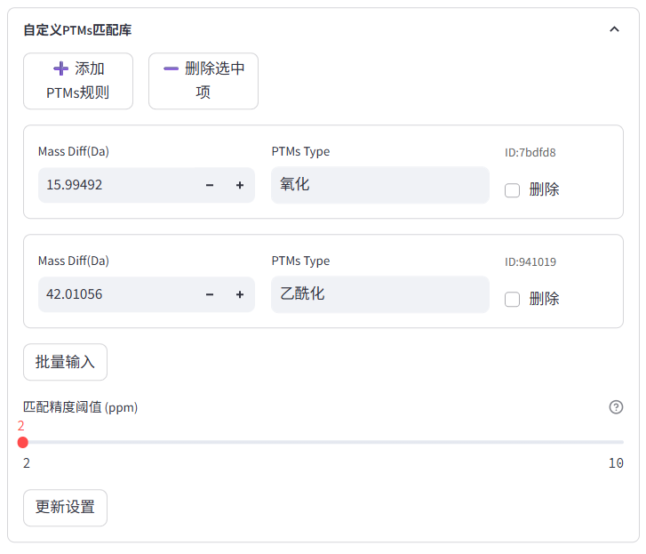
2. **Combinatorial Modifications**: Analyze multiple modification possibilities  
   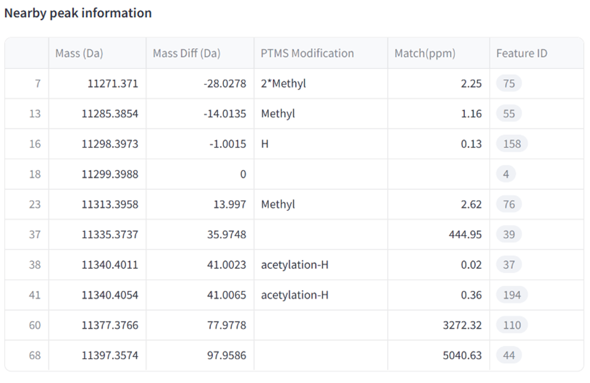
3. **Batch Parameter Import**: Save/Load frequently used configurations via JSON templates

#### 3.4 Advanced Visualization Modes

1. **3D Rendering**: Enable through `View Mode` in Heatmap Basic Settings
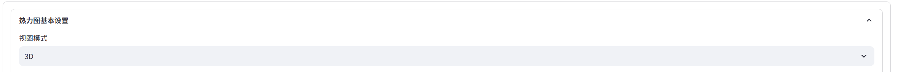

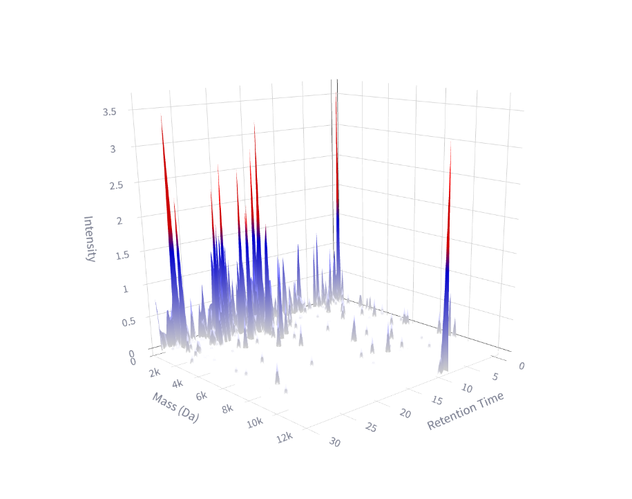

2. **Spectral Comparison**: Multi-sample alignment analysis

Using CYC dataset with multiple injections as example:

Activate comparison mode:
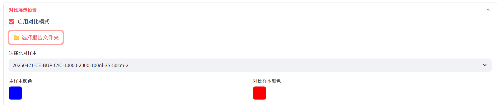
Select report folder via file dialog (must match initial selection)

Choose comparison samples and customize display colors

**Color scheme changes in comparison mode**:

- **2D Mode**: Discrete color assignment replaces gradient
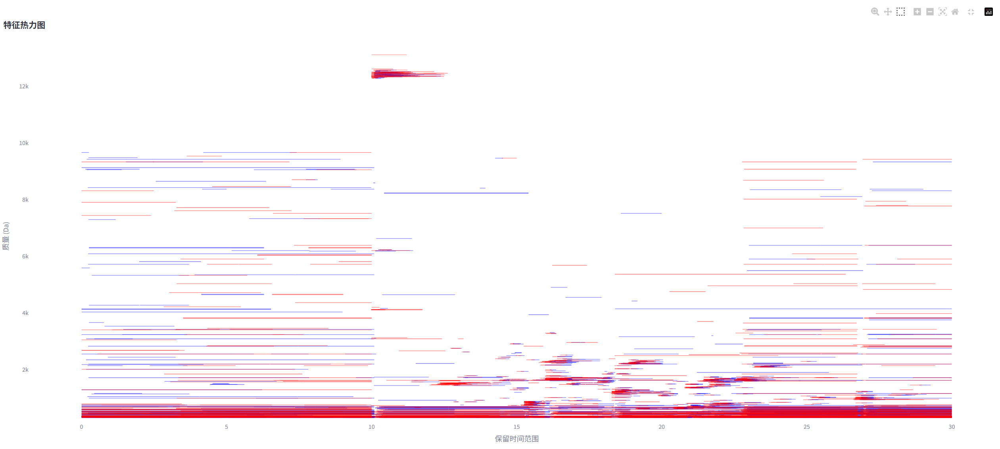
- **3D Mode**: Color differentiation with intensity-based transparency
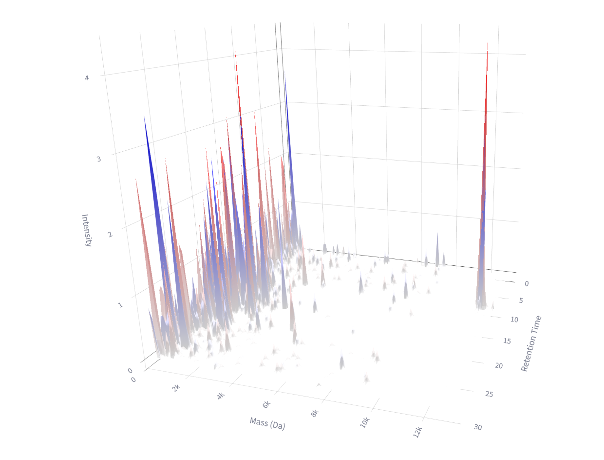

- **Mirror Plot**: *2D mode selection* generates mirrored spectra
   - Note: PTMs query unavailable in this mode
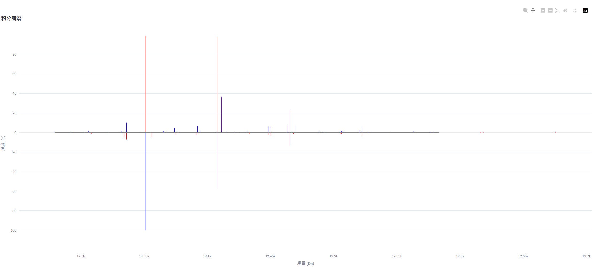

---

## Data Export
1. Download feature tables (TSV) from initial interface
2. Export interactive HTML plots from heatmap interface
3. Access Toppic-parsed MS2 results in third tab

---

## Roadmap
- [ ] Critical bug fixes
- [ ] Parameter optimization with user-configurable interfaces
- [ ] Publication-quality figure generation