## User Guide  
**Core Features**:  
- 🎨 **Feature Heatmaps**: Visualize proteoforms' chromatographic distribution  
- 🔍 **Automated Peak Detection**: Auto-calculate delta mass for PTMs identification  
- 🛠️ **Custom Analysis**: Support user-defined modification types for targeted search  
- 📊 **Interactive Spectral Visualization & Comparison**: 3D rendering and cross-sample spectral comparison  

---  

## Quick Start  
- Use the **"Box Select"** tool in the upper-right toolbar to select regions of interest  
- Adjust parameters via the interactive widgets around the figures  
- **Double-click the image** to:  
  - Update display settings (e.g., toggle PTM annotations)  
  - Clear current selection status  

---  

## Detailed Operation Guide  

### 1. Data Preparation  
**File Requirements**:  
- Click the `📂` icon in the left sidebar  
- Select TopPic raw result folder containing `_html` subdirectory  
- *Web users can directly specify database storage path*  

### 2. Main Visualization Interface  

#### 2.1 Feature Heatmap  
**Coordinate System**:  
- **X-axis**: Retention time (minutes)  
- **Y-axis**: Mass (*mass*, Da)  

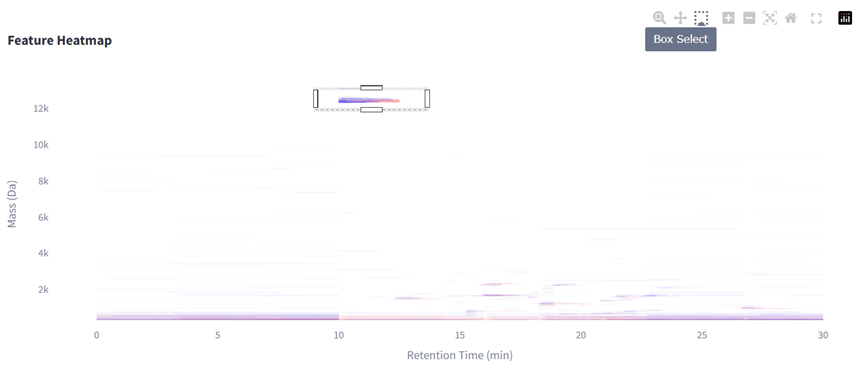  

**Workflow**:  
1. Click the third "Box Select" tool in the toolbar  
   - *Double-click blank area to exit selection mode*  
2. System automatically generates integrated spectrum for selected region  

#### 2.2 Integrated Spectrum Analysis  
**Coordinate System**:  
- **X-axis**: Mass (*mass*, Da)  
- **Y-axis**: Normalized intensity (%)  

  

**Analysis Strategy**:  
- Use the highest intensity peak as reference  
- **Mass difference**: Set expected intervals between target peak and adjacent peaks  

#### 2.3 PTM Identification  

**Custom PTMs**:  
Two input methods available:  
- Manual input  
- Batch input: Use fixed format templates. Frequent users are recommended to maintain their own modification library  

**Filter Parameters**:  
- **Target mass**: Default uses reference peak mass (supports manual hypothesis input)  
- **Mass tolerance** (±Da): Search radius for adjacent peaks (independent of selection area)  
- **Intensity threshold** (%): Hide the Peaks below the Threshold in the Table (> set value)  

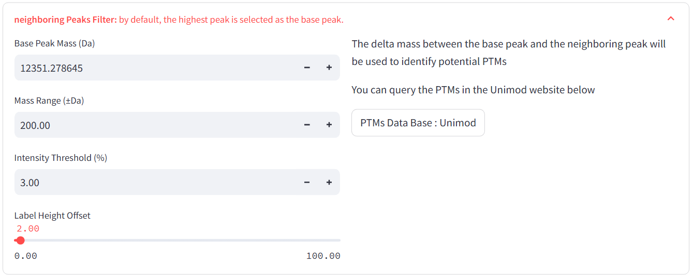  

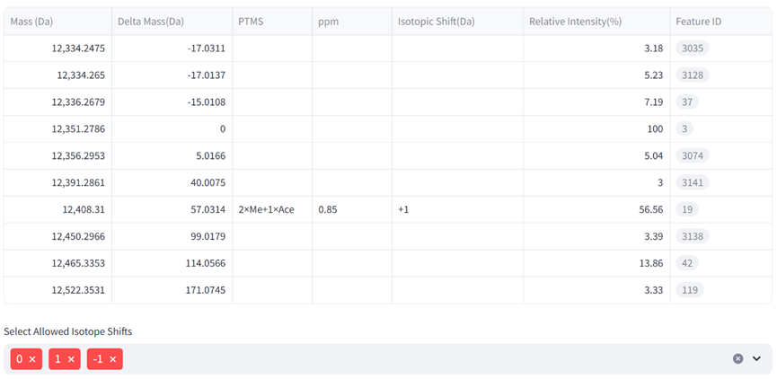  

After setting PTMs, double-click blank area to automatically annotate  

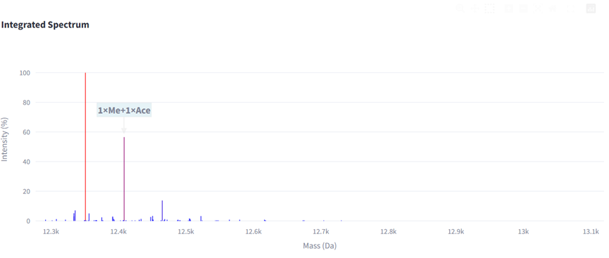  

❓ **Troubleshooting**: If target PTMs are not found, try:  
- Lowering intensity threshold (e.g., from 5% to 1%)  
- Expanding mass tolerance range  

#### 2.4 PTM Calculator  
Quickly generate modification combinations:  
1. Input:  
   - Modification abbreviation  
   - Chemical formula  
   - Maximum modification count  
   - *Supports formula difference calculation (e.g., `"C6H12O6 - H2O"`)*  
2. Click "Generate" button to calculate all combinations  
3. Paste JSON results into batch input module for automatic annotation  

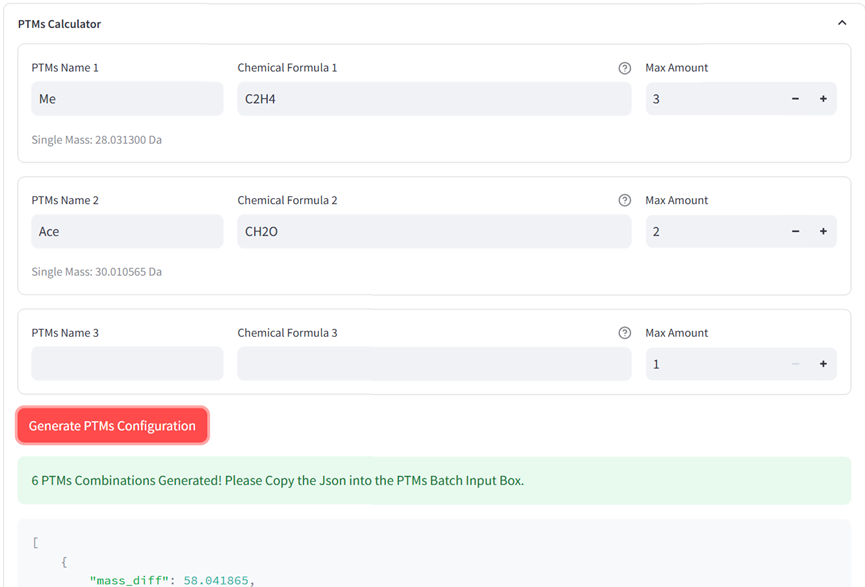  

#### 2.5 Prsm Query  
Input FeatureID of interest, TDvis will output navigation links to related Prsms  
Click to open TopPic's built-in visualization for sequence display  
Lower E-value indicates higher identification confidence  

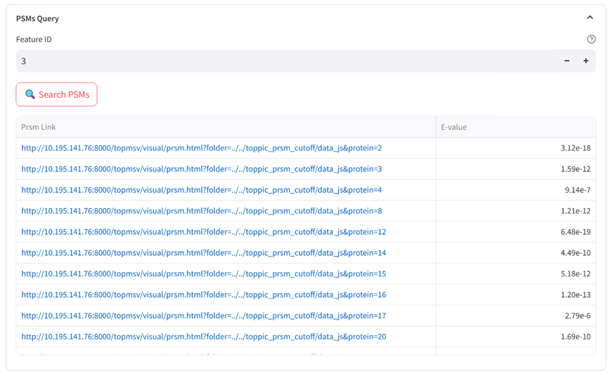  

#### 2.6 Advanced Visualization  
1. **3D Mode**:  
   - Switch "View Mode" in "Heatmap Basic Settings"  
   - 3D feature maps use same color mapping as 2D  

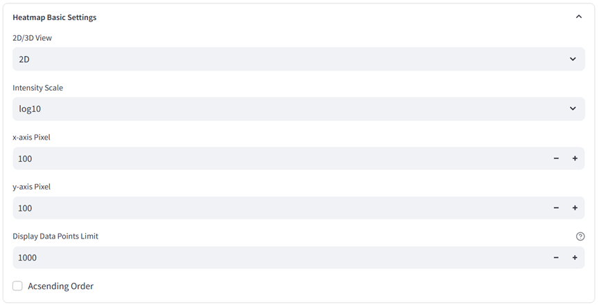  
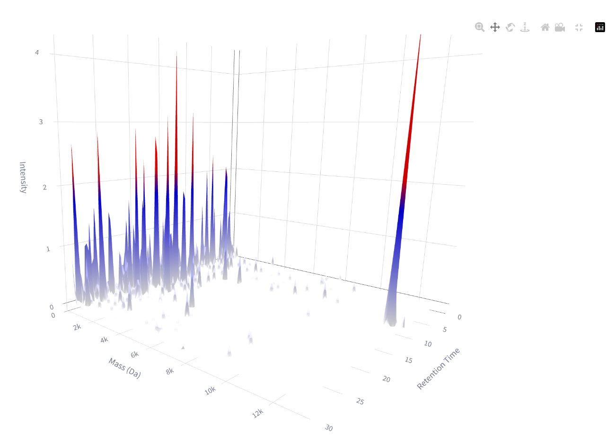  

2. **Spectrum Comparison**:  
   - Check "Compare Mode" checkbox  
   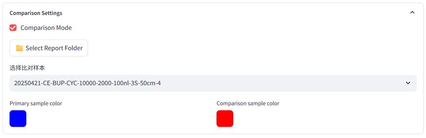  

   - Select comparison sample folder (requires same format as initial data)  

   **Display Modes**:  
   - **2D Comparison**: Different samples labeled with distinct colors  
     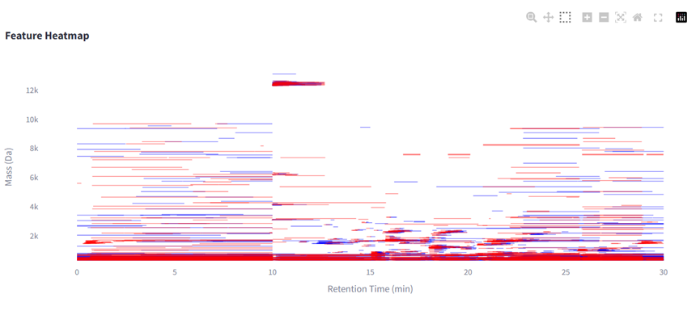  

   - **3D Comparison**: Transparency dynamically changes with intensity  
     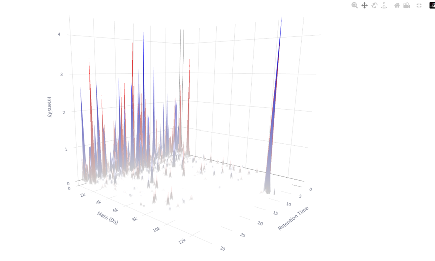  

   - **Mirror Plot**:  
     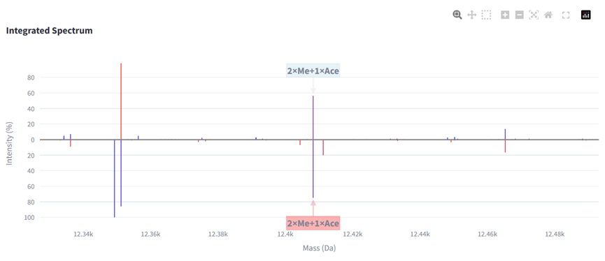  

### 3. Data Overview Interface  
Displays identification statistics and feature table data.  

### 4. Identification Results Interface  
Shows secondary structure information parsed by TopPic. Recommended to click "Open TopPic Report" for TopPic's built-in sequence visualization.  

---  

## Data Export  
1. **Feature Table**: Download TSV file from main interface  
2. **Interactive Figures**: Export as HTML via dedicated button  
3. **Secondary Data**: Obtain TopPic secondary analysis results in the third interface