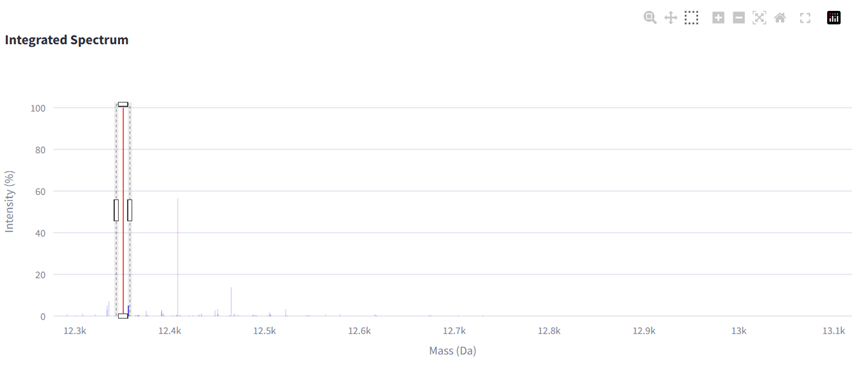
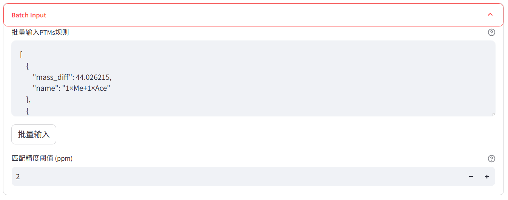
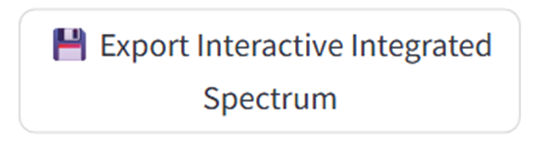

## 用户指南  
**核心功能**：  
- 🎨 **特征热图**：直观展示蛋白质变体在液相色谱中的分布  
- 🔍 **智能峰识别**：自动计算质量差异，辅助PTM鉴定  
- 🛠️ **自定义分析**：支持用户定义修饰类型进行靶向检索  
- 📊 **谱图可视化与对比**：三维渲染与多谱图对比分析  

---  

## 快速入门  
- 使用图像右上角工具栏中的「框选工具」选择感兴趣区域  
- 通过交互式图像周围的工具栏
- **双击图像**可以实现以下目标：  
  - 更新显示设置（如切换PTM标注）  
  - 清除当前框选状态  

---  

## 详细操作指南  

### 1. 数据准备  
**文件要求**：  
- 点击左侧边栏的 `📂` 图标  
- 选择包含 `_html` 子目录的Toppic原始结果文件夹  
- *网页版用户可直接选择数据库存储路径*  

### 2. 主可视化界面  

#### 2.1 特征热图  
**坐标系**：  
- **X轴**：色谱保留时间（分钟）  
- **Y轴**：质量（*mass*，Da）  

**操作流程**：  
1. 点击工具栏第三个「框选工具」 
   - *双击图像空白区域可退出框选模式*  
2. 系统自动生成选定区域的积分谱图  

#### 2.2 积分谱图分析  
**坐标系**：  
- **X轴**：质量（*mass*，Da）  
- **Y轴**：归一化强度（%）  

**分析策略**：  
- 以最高强度峰为基准峰  
- **质量差异**：设置目标峰与相邻峰的预期间隔  

#### 2.3 PTM鉴定  

**自定义PTMs**:
提供了两种输入方式
- 手动输入
- 批量输入: 通过固定的格式进行输入,对于重复使用的用户,建议建立自己的常用修饰的文件

**过滤参数**：  
- **目标质量**：默认采用基准峰质量（支持手动输入假设值）  
- **质量容差**（±Da）：相邻峰搜索半径（与框选区域无关）  
- **强度阈值**（%）：过滤相对强度低于阈值的峰，使其不在表格中显示（>设定值）  

在设定了PTMs之后,双击谱图空白处,即可自动进行标注

❓ **常见问题**：若未发现目标PTMs，请尝试：  
- 降低强度阈值（如从5%调整至1%）  
-  扩大质量容差范围  

#### 2.4 PTM计算器  
快速生成修饰组合：  
1. 输入
    - 修饰简称
    - 化学式
    - 及最大修饰数  
    - *支持化学式差值计算（如输入`"C6H12O6 - H2O"`）*  
2. 点击「生成」按钮计算所有组合  
3. 将JSON结果粘贴至批量输入模块来进行自动标注  

#### 2.5 Prsm查询
通过输入您感兴趣的FeatureID,TDvis即会输出导航向与其相关的Prsm的链接
点击即可打开TopPic自带的可视化来展示其序列
E-Value越小,则置信度越高

#### 2.6 高级可视化  
1. **三维模式**：  
   - 在「热力图基本设置」中切换「视图模式」  
   - 三维的特征图与二维采取同样的颜色映射
 

2. **谱图对比**：  
   - 勾选「对比模式」复选框  
    

   - 选择对比样本文件夹（需与初始数据格式一致）  

   **显示模式**：  
   - **二维对比**：不同样本用独立颜色标注  
     

   - **三维对比**：透明度随强度动态变化  

   
   - **镜像图**：
     

### 3. 数据概览界面  
显示鉴定结果统计与特征表格数据。  

### 4. 鉴定结果界面  
展示Toppic解析的二级结构信息。推荐点击「打开Toppic报告」查看TopPic自带的序列可视化。  

---  

## 数据导出  
1. **特征表格**：从首界面下载TSV格式文件  
2. **交互式图像**：通过专用按钮导出为HTML文件  

3. **二级数据**：在第三个界面获取Toppic二级解析结果 

